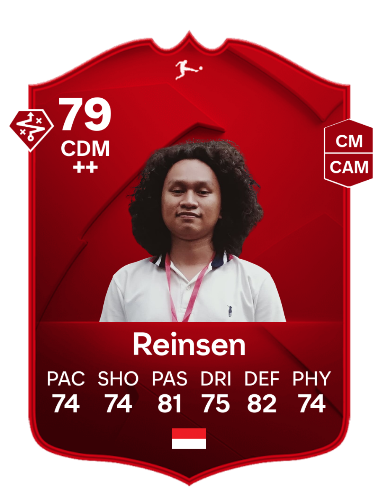

# Hi, I'm Reinsen Silitonga

## About Me

- Second-year Informatics Engineering Student at Bandung Institute of Technology
- Focus on exploring data science and software engineering

## Tech Stack

  

## My Stats

<table align="center" cellpadding="12" bgcolor="#1a2035">
  <tr>
    <td valign="middle" align="center" width="220" bgcolor="#1a2035">
      
    </td>
    <td valign="top" align="center" bgcolor="#1a2035">
      
       
      
       
      
    </td>
  </tr>
</table>

## Let's Connect

  
  
  

